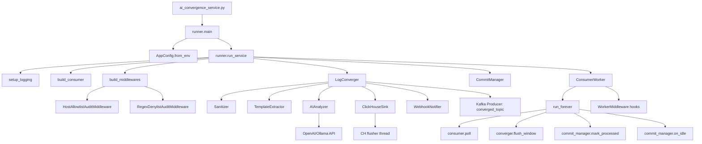

# 模块化改造后的执行流程

## 1) 启动链路（代码入口到运行）

```text
ai_convergence_service.py
  └─ log_pipeline.runner.main()
      ├─ AppConfig.from_env()
      └─ run_service(config)
          ├─ setup_logging()
          ├─ LogConverger(...)
          │   ├─ Sanitizer
          │   ├─ TemplateExtractor (Drain3/regex fallback)
          │   ├─ AIAnalyzer (cache/retry/fallback)
          │   ├─ ClickHouseSink (buffer + flusher)
          │   └─ WebhookNotifier
          ├─ build_consumer(config)
          ├─ build_middlewares(config, logger)
          ├─ CommitManager(...)
          ├─ ConsumerWorker(...)
          └─ worker.run_forever()
```

对应文件：
- `ai_convergence_service.py`
- `log_pipeline/runner.py`
- `log_pipeline/converger.py`
- `log_pipeline/consumer_worker.py`
- `log_pipeline/commit_manager.py`

## 1.1) 模块调用关系图（Mermaid）



## 1.2) 异常路径调用图（Mermaid）

```mermaid
graph TD
  A[ConsumerWorker.poll] --> B[_process_message]
  B --> C{middleware after_decode == None?}
  C -- 是 --> C1[跳过业务处理]
  C1 --> C2[CommitManager.mark_processed]
  C -- 否 --> D[LogConverger.process_message]
  D --> E[flush_window]

  E --> F{count >= threshold?}
  F -- 否 --> F1[直接产出 ai_analyzed=0]
  F -- 是 --> G[AIAnalyzer.analyze]
  G --> H{AI 调用成功?}
  H -- 否 --> I[重试 N 次]
  I --> J{重试后成功?}
  J -- 否 --> K[降级默认结果]
  J -- 是 --> L[使用AI结果]
  H -- 是 --> L

  F1 --> M[Kafka produce converged]
  K --> M
  L --> M

  M --> N{Kafka BufferError?}
  N -- 是 --> N1[poll(0.5) 后重试 produce]
  N -- 否 --> O[producer flush]
  N1 --> O

  O --> P[ClickHouseSink.enqueue]
  P --> Q[flusher thread]
  Q --> R{CH insert 成功?}
  R -- 否 --> R1[记录 CH 写入错误日志]
  R -- 是 --> R2[写入成功日志]

  L --> S{异常且置信度达阈值?}
  S -- 是 --> T[WebhookNotifier.send]
  T --> U{Webhook 成功?}
  U -- 否 --> U1[status=0 + 错误日志]
  U -- 是 --> U2[status=1]
  U1 --> V[storage_sink.insert_alert]
  U2 --> V

  A --> W{收到坏消息/解码异常?}
  W -- 是 --> X[on_process_error hooks]
  X --> Y[记录 JSON 解析错误日志]
  Y --> C2
```

## 2) 运行时主循环（ConsumerWorker）

`ConsumerWorker.run_forever()` 每轮处理：
1. `consumer.poll(1.0)` 拉取 Kafka 消息  
2. `converger.flush_window()` 检查窗口是否到期并做收敛  
3. 若无消息：`commit_manager.on_idle()`（按时间触发异步提交）  
4. 若有消息：
   - `_process_message()` 执行中间件 + JSON 解码 + converger 处理
   - `commit_manager.mark_processed()`（按批量/时间触发提交）
5. 退出时：
   - `commit_manager.flush_on_shutdown()` 兜底提交
   - `consumer.close()`

对应文件：
- `log_pipeline/consumer_worker.py`
- `log_pipeline/commit_manager.py`

## 3) 单条消息处理链路（_process_message）

`ConsumerWorker._process_message()` 内部顺序：
1. `before_decode(raw_message)`（可改原始字节）
2. JSON 解码为 `payload`
3. `after_decode(payload)`（可过滤，返回 `None` 则跳过）
4. `converger.process_message(payload)` 进入聚合
5. `on_process_success(payload)` 或 `on_process_error(...)`

对应扩展协议：
- `log_pipeline/middleware.py`

## 4) 窗口收敛链路（LogConverger）

`flush_window()` 到期后流程：
1. 遍历当前窗口聚合 key：`(window, host, pattern, level)`
2. 计算趋势（对比 `prev_window_counts`）
3. 分流：
   - 低频：直接产出 `ai_analyzed=0`
   - 高频：调用 `AIAnalyzer.analyze(...)`
4. 告警判断：异常 + 置信度达阈值 → 异步 webhook + `alert_history`
5. 输出：
   - 结果写 `linux_converged_logs`
   - 写入 `ClickHouseSink` 缓冲队列，后台批量刷盘
6. 更新窗口状态与上一窗口计数

对应文件：
- `log_pipeline/converger.py`
- `log_pipeline/ai_analyzer.py`
- `log_pipeline/clickhouse_sink.py`
- `log_pipeline/notifier.py`

## 5) 中间件装配规则（build_middlewares）

`runner.build_middlewares()` 按环境变量自动装配：
- `MIDDLEWARE_HOST_ALLOWLIST` → `HostAllowlistAuditMiddleware`
- `MIDDLEWARE_MESSAGE_DENY_REGEX`（`||` 分隔）→ `RegexDenylistAuditMiddleware`
- `MIDDLEWARE_AUDIT_ENABLED` 控制审计日志开关

对应文件：
- `log_pipeline/runner.py`
- `log_pipeline/middleware_examples.py`

## 6) 关键扩展点（可插拔）

1. **消息处理扩展**：实现 `WorkerMiddleware` 并在 `run_service(..., middlewares=[...])` 注入  
2. **AI扩展**：替换 `AIAnalyzerProtocol` 实现（例如接入其它模型平台）  
3. **存储扩展**：替换 `StorageSinkProtocol`（例如 ES/S3/TSDB）  
4. **告警扩展**：替换 `NotifierProtocol`（飞书/Slack/短信网关）  

对应接口：
- `log_pipeline/interfaces.py`

## 7) 维护建议

- 业务变更优先改 `converger.py`（流程编排）  
- 非功能需求（审计、过滤、采样）优先走中间件，避免侵入主链路  
- 资源与性能调优优先改 `config.py` 环境变量，不直接写死阈值  
- 新增能力时优先扩展协议实现，避免在 `runner.py` 堆逻辑  
