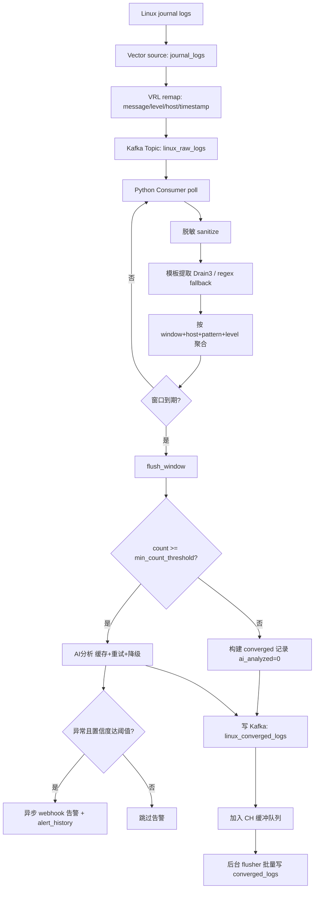
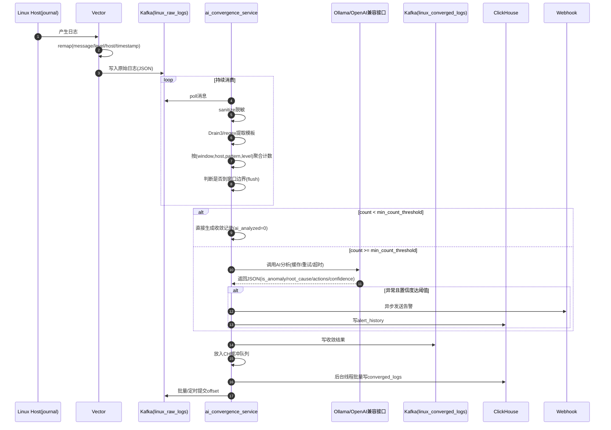

# 日志处理工作流（整合版）

## 1. 流程图（Flowchart）

## 2. 时序图（Sequence）

## 3. 文字说明

### 3.1 整体目标
系统将 Linux 主机日志进行采集、标准化、聚合、AI 分析与告警，并把结果持久化到 Kafka 与 ClickHouse，形成可查询、可告警、可诊断的日志收敛链路。

### 3.2 组件职责
- Linux Host：产生日志（systemd journal）。
- Vector：采集日志并做字段标准化，发送到 Kafka 原始主题。
- Kafka（`linux_raw_logs`）：承接原始日志流，解耦采集与分析。
- `ai_convergence_service.py`：核心处理服务，负责脱敏、模板提取、窗口聚合、AI 分析、告警与落库。
- Kafka（`linux_converged_logs`）：承接收敛后的结果消息。
- ClickHouse：存储收敛结果与告警历史。
- Webhook：接收异常告警通知。

### 3.3 详细处理流程（逐步）
1) 日志采集与标准化  
- Vector 通过 `journal_logs` 读取 Linux journal。  
- 在 `remap` 阶段把日志转换为统一字段：`message`、`level`、`host`、`timestamp`。  
- 转换后的 JSON 发往 Kafka 主题 `linux_raw_logs`。

2) 核心服务初始化  
- 启动 Kafka Consumer（消费 `linux_raw_logs`）与 Producer（写 `linux_converged_logs`）。  
- 初始化 Drain3 模板挖掘器；若不可用则自动降级到正则模板提取。  
- 初始化 ClickHouse 客户端与后台刷盘线程。  
- 初始化内存结构：聚合缓冲 `buffer`、上一窗口计数 `prev_window_counts`、AI 缓存（TTL + LRU）。

3) 消费与单条处理  
- 服务循环 `poll` Kafka 消息。  
- 每条消息执行：读取字段 → 脱敏 → 模板提取 → 计算窗口 → 按 `(window, host, pattern, level)` 聚合（`count/first_ts/last_ts/samples`）。

4) 窗口收敛（flush）  
- 每轮消费都会检查是否跨过窗口边界。  
- 窗口结束时，遍历当前窗口聚合项并计算趋势（对比上一窗口同 key 计数）。  
- 若 `count < min_count_threshold`：直接产出 `ai_analyzed=0` 记录。  
- 若 `count >= min_count_threshold`：进入 AI 分析。

5) AI 分析与降级  
- 构造提示词请求 AI 返回 JSON。  
- 先查缓存，未命中才调用；失败会重试；重试后仍失败则使用降级规则结果。

6) 告警处理  
- 当 `is_anomaly=true` 且 `confidence` 超阈值：异步 webhook 发送告警，并写 `alert_history`。

7) 结果输出与落库  
- 窗口结果先写 Kafka `linux_converged_logs`。  
- 同时放入 ClickHouse 缓冲队列。  
- 后台线程批量写入 ClickHouse `converged_logs`。

8) 位点提交与可靠性策略  
- Kafka offset 采用“批量条数 + 时间间隔”提交。  
- 退出前兜底同步提交。  
- 下游失败策略：AI 失败可降级、Webhook 失败不阻断主链路、CH 写失败记录错误日志。

### 3.4 联调与诊断流程
- `scripts/e2e_smoke_test.sh`：一键完成起依赖、建表、起服务、注入日志、结果验证。  
- 失败时自动触发 `scripts/collect_diagnostics.sh` 采集诊断包（支持保留天数清理）。

## 4. 模块化执行流程（拆分后）
- 兼容入口：`ai_convergence_service.py`（保持原启动命令不变）
- 装配层：`log_pipeline/runner.py`（组装 consumer/worker/commit/middlewares）
- 消费层：`log_pipeline/consumer_worker.py`（poll、解码、调用 converger、提交位点）
- 提交层：`log_pipeline/commit_manager.py`（批量 + 定时 + 关闭兜底提交）
- 业务编排层：`log_pipeline/converger.py`（窗口聚合、AI分流、告警、落库）
- 详细拆分链路见：`docs/refactored_execution_flow.md`
